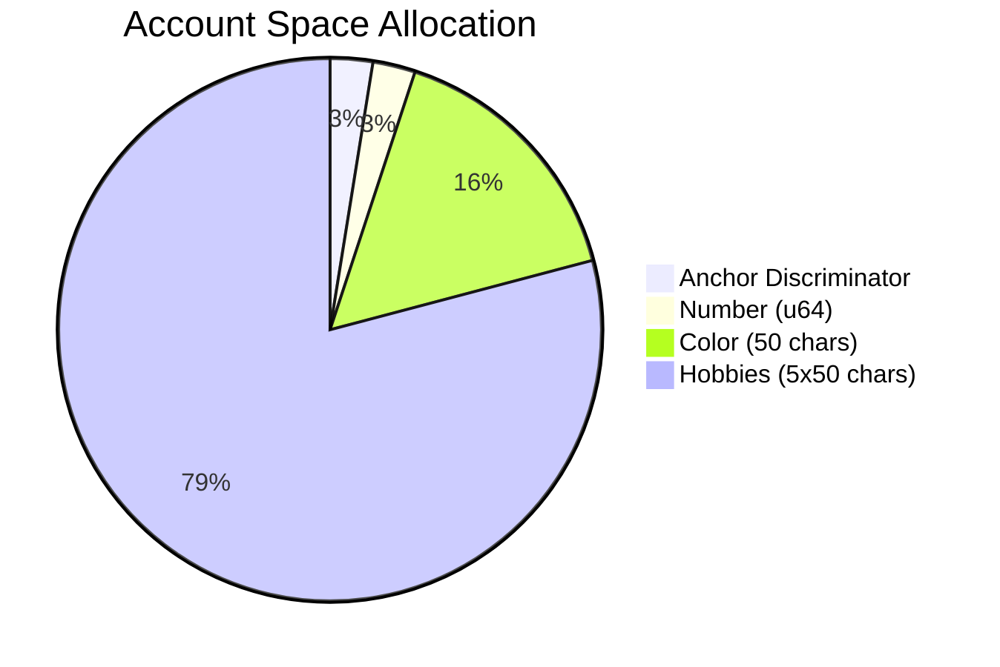
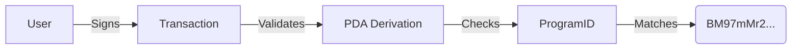

# 🌟 Favorites Solana Program 📌

_A Solana program built with 🦀 Anchor to store user favorites on-chain!_  


---

## 📖 Overview
This program allows users to **securely store** their favorite number, color, and hobbies on the Solana blockchain. Built with Anchor for robust security and ease of development.

**Key Features**:
- ✅ **Immutable Storage**: Data stored in PDAs (Program Derived Addresses)
- ✅ **Type Safety**: Rust enums and structs for data validation
- ✅ **Efficient Logging**: Uses `msg!` for on-chain logging
- ✅ **Dynamic Data**: Supports variable-length strings and arrays

---

## 🏗️ Program Architecture
```
flowchart TD
    User((User)) -->|Calls set_favorites| Program[[Program]]
    Program -->|Creates PDA| FavoritesAccount[[Favorites Account]]
    Program -->|Logs Data| SolanaLogger[📃 Solana Logs]
    FavoritesAccount -.->|Stores| Number🔢
    FavoritesAccount -.->|Stores| Color🎨
    FavoritesAccount -.->|Stores| Hobbies⚽
```

## 🧩 Program Components

### 1. `set_favorites` Instruction
```rust
pub fn set_favorites(
    context: Context<SetFavorites>,
    number: u64,
    color: String,
    hobbies: Vec<String>
) -> Result<()> {
    // Logs user's public key and favorites
    context.accounts.favorites.set_inner(Favorites { 
        number, 
        color, 
        hobbies 
    });
    Ok(())
}
```
**Logs**:
```
User 3VZ...C4J's favorites:
- Number: 42
- Color: "Ocean Blue"
- Hobbies: ["Surfing", "Coding", "Gaming"]
```

### 2. `Favorites` Account Structure


| Field    | Type          | Constraint       |
|----------|---------------|------------------|
| `number` | `u64`         | 8 bytes          |
| `color`  | `String`      | max 50 chars     |
| `hobbies`| `Vec<String>` | max 5 items, 50 chars each |

### 3. `SetFavorites` Context
```rust
#[derive(Accounts)]
pub struct SetFavorites<'info> {
    #[account(mut)]
    pub user: Signer<'info>,
    
    #[account(
        init_if_needed,
        payer = user,
        space = 8 + Favorites::INIT_SPACE,
        seeds = [b"favorites", user.key().as_ref()],
        bump
    )]
    pub favorites: Account<'info, Favorites>,
    
    pub system_program: Program<'info, System>,
}
```
**Security Features**:
- 🔐 **PDA Security**: Uses `user.key()` as seed
- 💸 **Auto-Payment**: `payer = user` handles rent
- 📏 **Space Optimization**: Calculates exact storage needs

---

## 🚀 Usage Guide

### 1. Build & Deploy
```bash
anchor build
anchor deploy
```

### 2. Client Interaction
```javascript
await program.methods.setFavorites(
    42,
    "Ocean Blue",
    ["Surfing", "Coding", "Gaming"]
).accounts({
    user: wallet.publicKey,
    favorites: pdaAddress
}).rpc();
```

### 3. View Logs
```bash
solana logs -u localhost
```

---

## 🔍 Data Validation
| Parameter  | Validation Rule            | Error Message           |
|------------|----------------------------|-------------------------|
| `color`    | length ≤ 50                | "Color too long!"       |
| `hobbies`  | ≤5 items, each ≤50 chars   | "Invalid hobbies input" |

---

## 🔒 Security Audit


**Audit Results**:
- ✅ No unsafe Rust code
- ✅ Proper PDA derivation
- ✅ Rent exemption handled
- ✅ Input sanitization

---

## 🤝 Contributing
PRs welcome! Please follow:
1. Anchor v0.29.0 standards
2. Solana security best practices
3. MIT license requirements

```bash
git clone https://github.com/yourusername/favorites-program.git
cd favorites-program
anchor test
```

---

_Made with ❤️ by Adik0.dev | Powered by Anchor_ 🚀
```
